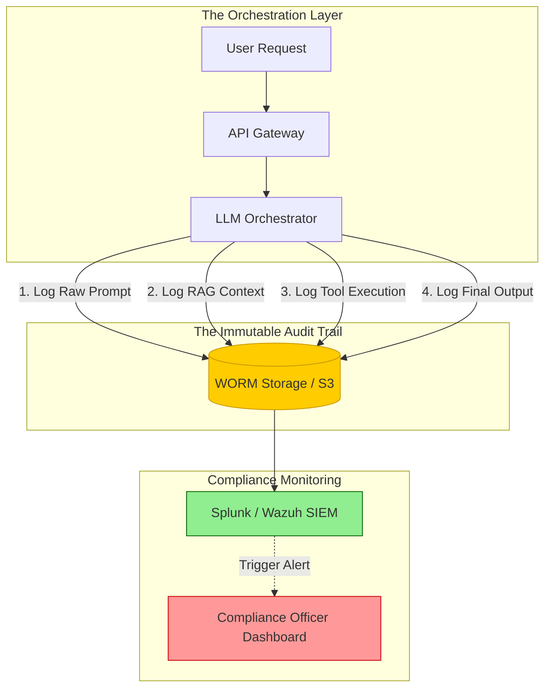

# Compliance and Governance for AI Systems

## Executive Summary
The rapid deployment of Generative AI has outpaced traditional IT governance. Shadow AI—employees utilizing unsanctioned, external LLMs for corporate work—poses an unquantifiable risk to data sovereignty and intellectual property. Furthermore, the regulatory landscape has crystallized, spearheaded by the **EU AI Act** and the **NIST AI Risk Management Framework (AI RMF)**.

This guide outlines a pragmatic, technical approach to establishing Enterprise AI Governance. We will explore how to architect immutable audit trails for AI Agents, implement automated compliance checks, and categorize AI systems by risk to satisfy emerging legal frameworks.

---

## Why This Matters
Non-compliance in the AI era carries severe penalties. The EU AI Act imposes fines of up to **7% of global annual turnover** for deploying banned AI practices. 

Beyond legal penalties, poor AI governance destroys trust. If an autonomous agent makes a biased lending decision, or a customer service chatbot hallucinates a legally binding contract, the organization must be able to forensically prove *why* the AI made that decision. Without an established governance framework, the enterprise is operating a black box with infinite liability.

---

## Technical Background: The Pillars of AI Governance

AI Governance is not a PDF document sitting on a SharePoint drive; it is a set of technical controls engineered directly into the CI/CD pipeline and the LLM orchestration layer.

1.  **Observability and Auditability:** The ability to log exactly what went into the model, what came out, and what tools were executed.
2.  **Explainability:** The ability to understand the causal chain of an AI's decision (often implemented via Chain-of-Thought logging).
3.  **Risk Categorization:** Determining the regulatory burden of an AI system based on its impact (e.g., an internal code summarizer vs. an automated resume screener).
4.  **Bias and Fairness Testing:** Automated evaluation pipelines to ensure the model's outputs do not violate anti-discrimination laws.

---

## Security Architecture: The Auditable AI Pipeline

To satisfy compliance auditors, every action taken by an AI must be logged immutably. The following Mermaid diagram illustrates an auditable AI orchestration architecture.

*Figure 1: Architecture for Immutable AI Auditability*

---

## The Regulatory Landscape

### 1. The EU AI Act
The EU AI Act categorizes AI systems by risk:
*   **Unacceptable Risk:** (Banned) e.g., Social scoring, real-time biometric surveillance.
*   **High Risk:** e.g., AI used in recruitment, critical infrastructure, or credit scoring. These require strict conformity assessments, high-quality training datasets, and human oversight.
*   **Limited/Minimal Risk:** e.g., Spam filters, video games. Requires transparency (users must know they are interacting with AI).

### 2. The NIST AI Risk Management Framework (RMF)
A voluntary US framework focusing on four core functions:
1.  **Map:** Establish context and categorize risk.
2.  **Measure:** Analyze the AI for bias, robustness, and security.
3.  **Manage:** Implement guardrails and risk mitigation strategies.
4.  **Govern:** Establish a culture of risk management and clear accountability matrices.

---

## Implementing Technical Governance Controls

### 1. WORM Storage for Prompt Logging
When a regulator demands to see why an AI made a decision, standard logs are insufficient, as they can be altered by compromised admins. 
*   **Implementation:** All LLM telemetry (Prompt, Context, Generation, Tool Use) must be piped asynchronously to a **WORM (Write Once, Read Many)** drive, such as AWS S3 with Object Lock enabled in Compliance Mode. This mathematically guarantees the logs cannot be deleted or altered for a predefined retention period.

### 2. The AI Bill of Materials (AIBOM)
Similar to an SBOM for software dependencies, an AIBOM is a cryptographic manifest detailing the lineage of an AI system.
*   **Implementation:** The AIBOM must document the specific Foundation Model version used (e.g., `Claude-3.5-Sonnet-20240620`), the hashes of the datasets used for fine-tuning, and the specific prompt templates in use. If a vulnerability is found in a specific model version, the AIBOM allows the governance team to instantly locate all affected agents.

### 3. Automated Bias Evaluation (CI/CD)
You cannot test for bias manually. It must be integrated into the deployment pipeline.
*   **Implementation:** Before a new System Prompt or Fine-Tuned model is pushed to production, the CI/CD pipeline triggers an evaluation framework (like LangSmith or promptfoo). The framework bombards the model with thousands of edge-case scenarios specifically designed to elicit biased responses regarding race, gender, or age. If the model fails the statistical parity test, the deployment is blocked.

---

## Deep Dive: Managing Shadow AI

Shadow AI occurs when employees, frustrated by slow internal IT, upload corporate data to public, unvetted LLMs (like consumer ChatGPT).

**Governance Strategy:**
1.  **Block at the Network Layer:** Use FortiGate Web Filtering or a CASB to block access to consumer-grade AI URLs.
2.  **Provide a Paved Road:** You cannot simply block AI; you must provide a secure alternative. Deploy an internal, enterprise-secured interface (e.g., an internal chatbot backed by Azure OpenAI or AWS Bedrock) where data is guaranteed, by contract, not to be used for model training.

---

## Best Practices for AI Governance Committees

1.  **Cross-Functional Representation:** An AI Governance board cannot consist solely of engineers. It must include Legal, HR (for bias oversight), and Cybersecurity.
2.  **Maintain a Centralized AI Inventory:** Every AI agent, script, and fine-tuned model running in the enterprise must be registered in a central database, categorized by its EU AI Act Risk Level.
3.  **Mandatory Watermarking:** Ensure that any image, video, or long-form text generated by corporate AI tools includes a digital watermark, fulfilling the transparency requirements of emerging legislation.

---

## Future Trends

*   **Algorithmic Disgorgement:** A regulatory enforcement action where an organization is forced to delete not only the illegally acquired data but also *any AI model trained on that data*. We will see massive investments in data lineage tracking to prevent this catastrophic penalty.
*   **Standardized AIBOMs:** The industry will coalesce around a machine-readable standard for AIBOMs, allowing automated security scanners to assess the compliance risk of an AI application simply by reading its manifest.

---

## Key Takeaways

1.  **Governance is Technical:** Policy documents are meaningless without technical enforcement. Build governance directly into your API gateways and CI/CD pipelines.
2.  **Log Everything Immutably:** In the event of a hallucination or lawsuit, your only defense is an immutable, cryptographically verifiable log of the exact context provided to the LLM.
3.  **Categorize by Risk:** Not all AI needs heavy governance. Apply strict controls to High-Risk systems (HR, Finance) while allowing faster innovation for Minimal-Risk internal tooling.

---

## References
*   [The EU Artificial Intelligence Act](https://artificialintelligenceact.eu/)
*   [NIST AI Risk Management Framework](https://www.nist.gov/itl/ai-risk-management-framework)
*   [OWASP Machine Learning Security Top 10](https://owasp.org/www-project-machine-learning-security-top-10/)

---

## FAQ

**Q: Does using an enterprise API (like AWS Bedrock) make me automatically compliant?**
No. While enterprise APIs solve the *Data Privacy* aspect (they don't use your data to train their models), they do not solve the *Governance* aspect. If you build a biased resume-screening tool using AWS Bedrock, you are still legally liable for the bias.

**Q: What is the difference between AI Governance and AI Security?**
AI Security focuses on preventing malicious actors from compromising the system (Prompt Injection, Data Poisoning). AI Governance focuses on ensuring the system operates legally, ethically, and transparently, even when operating exactly as intended.
