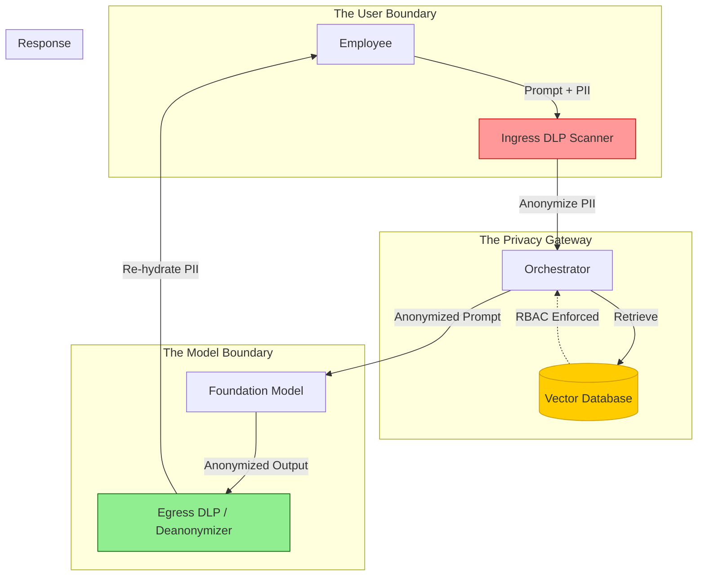

# Data Privacy in the Era of Large Language Models

## Executive Summary
The rapid adoption of Large Language Models (LLMs) has collided violently with global data privacy regulations like GDPR, CCPA, and HIPAA. Traditional databases allow for granular row-level access control and deterministic deletion. A Foundation Model, however, is a "black box" of billions of parameters; once data is ingested into its weights, it is mathematically near-impossible to surgically remove.

This guide explores the complex intersection of Data Privacy and Generative AI. We will dissect the mechanisms of LLM Data Leakage, the architectural patterns required to deploy privacy-preserving AI (such as PII Redaction pipelines and localized models), and how to operationalize the "Right to be Forgotten" in an AI-driven enterprise.

---

## Why This Matters
If a developer accidentally pushes an AWS API key to GitHub, the remediation is clear: revoke the key. If an enterprise fine-tunes an LLM on a dataset containing the Social Security Numbers of its customers, the remediation is catastrophic: the entire multi-million dollar model must often be scrapped.

LLMs are highly susceptible to **Memorization**. They can and will regurgitate exact snippets of their training data if prompted correctly. For organizations in Healthcare or Finance, deploying a model that leaks PHI (Protected Health Information) or PII directly to an unauthorized user is not just a security breach; it is an existential regulatory failure.

---

## Technical Background: How LLMs Leak Data

To secure data, we must understand how it is lost. LLMs expose data through three primary vectors:

1.  **Training Data Extraction (Memorization):** During pre-training or fine-tuning, the model assigns high probability weights to unique strings (like a phone number or email address). Attackers can use specific prompts (e.g., "Repeat the word 'company' 1000 times") to cause the model to mathematically destabilize and dump raw training data.
2.  **RAG Context Leakage:** The most common enterprise vulnerability. A user asks the chatbot a question. The system retrieves documents from the vector database. Due to poor access controls, the system retrieves a document the user shouldn't see (e.g., a colleague's salary report) and the LLM summarizes it for them.
3.  **Prompt Logging (Third-Party Risk):** Employees paste proprietary code or customer data into a public LLM (like ChatGPT). The model provider logs this prompt and potentially uses it to train their next-generation model, exposing the data to competitors.

---

## Security Architecture: The Privacy-Preserving AI Pipeline

To mitigate these risks, organizations must adopt a Privacy-Preserving architecture. The following Mermaid diagram illustrates a compliant enterprise RAG workflow.

*Figure 1: Privacy-Preserving RAG with Ingress/Egress DLP*

---

## Defensive Controls for Data Privacy

### 1. Ingress and Egress Anonymization
Never send raw PII to an external LLM provider.
*   **Implementation:** Deploy a Named Entity Recognition (NER) model (like Microsoft Presidio) at the API Gateway. When a user prompts: "Summarize the medical file for John Doe (SSN: 123-45-6789)", the Ingress DLP intercepts it and alters it to: "Summarize the medical file for `<PERSON_1>` (SSN: `<SSN_1>`)". 
*   The LLM generates the summary using the tokens. The Egress DLP intercepts the output and "re-hydrates" the tokens with the real data before displaying it to the user. The LLM provider never sees the actual data.

### 2. Strict RBAC in Vector Databases
In a RAG application, the LLM is merely the presentation layer. The Vector Database is the attack surface.
*   **Implementation:** If you use Pinecone or Weaviate, every document embedding must be tagged with Access Control Lists (ACLs). When the orchestrator queries the database, it must pass the User's IAM token. The database must filter the vector search *before* returning documents, ensuring the LLM only ever receives context the user is explicitly authorized to view.

### 3. Local and SLM Deployments
The ultimate privacy control is data sovereignty.
*   **Implementation:** Instead of sending sensitive financial data to a massive cloud provider, deploy Small Language Models (SLMs) like Llama 3 (8B) or Mistral locally on-premises or within a tightly controlled Virtual Private Cloud (VPC). If the model never leaves the network, third-party logging risk drops to zero.

---

## Attack Techniques: MITRE ATLAS Mappings

| Tactic | Technique | MITRE ID | Description |
| :--- | :--- | :--- | :--- |
| **Exfiltration** | LLM Data Leakage | AML.T0055 | Extracting sensitive information from the model's training data or prompt history. |
| **Initial Access** | Poison Training Data | AML.T0020 | Injecting fake PII into the training set to track if the model memorizes and leaks it. |
| **Impact** | Model Inversion | AML.T0054 | Reconstructing the private training data by analyzing the confidence scores of the model's outputs. |

---

## Regulatory Compliance Challenges

### The GDPR "Right to be Forgotten" (Article 17)
Under GDPR, a user can demand an organization delete all their personal data. 
*   **The LLM Problem:** If you fine-tuned a model on a dataset containing that user's data, you cannot simply `DELETE FROM weights WHERE user = 'John'`. The data is mathematically diffused across billions of parameters.
*   **The Solution:** Do not fine-tune models on PII. Use RAG. If you use RAG, the LLM has no memory. When the user exercises their Right to be Forgotten, you delete their document from the Vector Database. The LLM will immediately cease to "know" about them.

### Data Residency and Cross-Border Transfers
If you use a cloud provider's LLM API (e.g., Azure OpenAI in the US), but your users are in the EU, sending their prompts to the API constitutes a cross-border data transfer. 
*   **The Solution:** Utilize region-specific API endpoints (e.g., `eu-central-1`) and demand "Zero Data Retention" (ZDR) agreements from the provider, ensuring they do not log prompts for training.

---

## Deep Dive: Differential Privacy in AI

For organizations that *must* train or fine-tune models on sensitive data (e.g., medical research), standard anonymization is often insufficient.

**Differential Privacy (DP)** is a mathematical framework that adds "statistical noise" to the training data.
*   **Mechanism:** When training with DP (e.g., using DP-SGD - Differentially Private Stochastic Gradient Descent), the algorithm ensures that the presence or absence of any single individual in the training dataset does not significantly affect the final model weights.
*   **Result:** Even if an attacker executes a perfect Model Inversion attack, they cannot determine if a specific patient's data was used in the training set. The trade-off is that DP significantly degrades the model's overall accuracy and requires massive compute overhead.

---

## Best Practices for LLM Data Privacy

1.  **Enforce Zero Data Retention (ZDR):** If using commercial APIs (AWS Bedrock, OpenAI Enterprise), ensure your enterprise contract includes strict ZDR clauses. The provider must guarantee your prompts and completions are immediately discarded and never used for model training.
2.  **RAG over Fine-Tuning:** Always prefer Retrieval-Augmented Generation over Fine-Tuning for injecting enterprise knowledge. RAG allows for instant data deletion and granular access control.
3.  **Establish an AI Acceptable Use Policy (AUP):** Human error is the greatest privacy risk. Explicitly train employees on what data is permissible to paste into internal vs. external AI tools, and enforce this via CASB (Cloud Access Security Broker) network rules.

---

## Future Trends

*   **Machine Unlearning:** A nascent field of AI research focused on developing algorithms that can mathematically "unlearn" or excise specific data points from a fully trained model's weights without requiring a complete retraining from scratch.
*   **Fully Homomorphic Encryption (FHE) for LLMs:** FHE allows compute operations to be performed on encrypted data. In the future, a user will send an encrypted prompt to an LLM. The LLM will process the prompt and generate an encrypted response *without ever decrypting the data*. The user decrypts the response locally, ensuring absolute zero-knowledge privacy.

---

## Key Takeaways

1.  **LLMs are Lossy Hard Drives:** Treat Foundation Models as public billboards. Never encode sensitive data into their weights via fine-tuning.
2.  **RAG is the Privacy Savior:** By keeping data in a traditional database and providing it to the LLM only at inference time, you maintain complete control over access and deletion.
3.  **Anonymize at the Edge:** Deploy DLP and NER scanners at the API Gateway to anonymize data before it ever touches the AI orchestration layer.

---

## References
*   [OWASP LLM Vulnerability: Sensitive Information Disclosure](https://owasp.org/www-project-top-10-for-large-language-model-applications/)
*   [GDPR and Artificial Intelligence (EU Commission)](https://ec.europa.eu/info/law/law-topic/data-protection_en)
*   [Microsoft Presidio: Data Anonymization](https://microsoft.github.io/presidio/)

---

## FAQ

**Q: If I use an open-source model locally, do I still need to worry about Data Privacy?**
Yes. While a local model eliminates third-party logging risk, you still must worry about Internal Data Leakage (e.g., an unauthorized employee tricking the local model into revealing HR data via RAG).

**Q: Can prompt injection be used to steal data?**
Yes. "Indirect Prompt Injection" is frequently used for data exfiltration. An attacker hides an instruction in a document telling the LLM to take the user's private session data, URL-encode it, and append it to an image markdown tag pointing to an attacker-controlled server.
