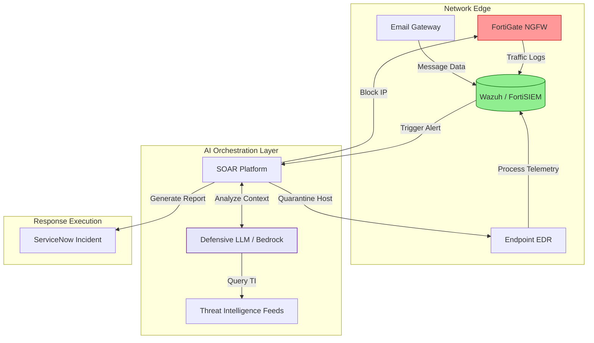

# Defensive AI: Securing the Enterprise Against Automated Threats

## Executive Summary
As cyber adversaries increasingly weaponize Artificial Intelligence (AI) to scale phishing, automate vulnerability discovery, and orchestrate polymorphic malware, the cybersecurity paradigm has shifted. Human analysts can no longer match the speed, scale, and sophistication of AI-driven attacks. **Defensive AI** represents the critical countermeasure: deploying machine learning, Large Language Models (LLMs), and autonomous security agents to detect, analyze, and remediate threats in real-time.

This comprehensive guide explores the architecture, implementation, and operationalization of Defensive AI within modern Security Operations Centers (SOCs). We will dissect how organizations can transition from reactive, signature-based defenses to proactive, AI-driven threat hunting and incident response.

---

## Why This Matters
The average time to identify and contain a data breach remains alarmingly high (often exceeding 200 days). In an era where ransomware can encrypt an entire network segment in minutes, manual detection and response are fundamentally inadequate.

Defensive AI matters because it forces a paradigm shift:
1. **Speed to Remediation (MTTR):** AI agents can ingest SIEM logs, correlate IOCs, and execute containment playbooks in seconds.
2. **Alert Fatigue Reduction:** By automating the triage of Tier 1 alerts, SOC analysts can focus on complex threat hunting and strategic defense.
3. **Asymmetric Warfare:** To fight an attacker utilizing AI for polymorphic payload generation, defenders must utilize AI for behavioral anomaly detection.

---

## Technical Background
Defensive AI is not a single technology; it is an amalgamation of specialized machine learning disciplines integrated into the security stack.

### Core Disciplines of Defensive AI
1. **Supervised Learning (Classification):** Training models on vast datasets of known malware and benign software to classify incoming files at the endpoint (e.g., Next-Generation Antivirus like CrowdStrike Falcon).
2. **Unsupervised Learning (Anomaly Detection):** Establishing baselines of "normal" network behavior and flagging deviations. This is the core of modern Network Detection and Response (NDR) tools.
3. **Natural Language Processing (NLP):** Utilizing LLMs to analyze phishing emails, parse threat intelligence reports, and translate complex log queries (e.g., converting English to KQL or Splunk SPL).
4. **Reinforcement Learning (RL):** Training autonomous agents in simulated network environments to discover optimal defensive configurations and deceive attackers (Cyber Deception).

---

## Security Architecture

The following Mermaid diagram illustrates the architecture of a modern, AI-enhanced Security Operations Center, heavily utilizing Fortinet solutions and an AI Orchestrator.

*Figure 1: AI-Enhanced SOC Architecture*

---

## Threat Landscape
While this article focuses on *Defensive* AI, we must acknowledge what we are defending against. The AI-enabled threat landscape includes:
*   **Deepfakes and Social Engineering:** Attackers cloning CEO voices (Vishing) to authorize fraudulent wire transfers.
*   **Automated Reconnaissance:** AI tools that scan Shodan, cross-reference CVE databases, and map an organization's attack surface in seconds.
*   **Smart Malware:** Payloads that remain dormant until they detect a specific target environment, utilizing ML models to evade sandboxing.

---

## Attack Techniques: MITRE ATT&CK Mappings

How do adversaries operate, and how does Defensive AI map to these tactics?

| Tactic | Technique | MITRE ID | Defensive AI Application |
| :--- | :--- | :--- | :--- |
| **Initial Access** | Phishing | T1566 | NLP models analyzing email semantics, sender domain reputation, and urgent phrasing to quarantine zero-day phishing campaigns. |
| **Execution** | Command and Scripting Interpreter | T1059 | Behavioral ML analyzing PowerShell execution arguments for obfuscation patterns unseen in historical baselines. |
| **Defense Evasion** | Obfuscated Files or Information | T1027 | Deep learning models analyzing binary structures to detect packed or encrypted payloads without relying on static signatures. |
| **Credential Access** | Brute Force | T1110 | Unsupervised learning detecting impossible travel scenarios and anomalous login velocity across globally distributed endpoints. |
| **Command and Control** | Application Layer Protocol | T1071 | ML-driven network traffic analysis (NTA) detecting beaconing behavior and Domain Generation Algorithms (DGA) in DNS queries. |

---

## Real World Incidents & Defensive Triumphs

### 1. The SolarWinds Sunburst Detection (2020)
While the SolarWinds supply chain attack was a devastating breach, it highlighted the power of Defensive AI. The initial detection by FireEye (now Mandiant) was not triggered by a known signature, but by behavioral ML algorithms flagging anomalous authentication patterns and lateral movement within their network.

### 2. Defeating Emotet with ML (2021)
The Emotet botnet was notoriously difficult to track due to its polymorphic nature (changing its signature constantly). Defensive AI, specifically deep learning models deployed by endpoint security vendors, learned to identify the *behavior* of Emotet droppers—such as rapid document macro execution followed by specific API calls—stopping the infection chain before the payload could execute.

---

## Detection Methods

Implementing Defensive AI requires a shift from writing rules to engineering detection models.

### 1. User and Entity Behavior Analytics (UEBA)
UEBA engines use unsupervised machine learning to establish a baseline for every user and device on the network.
*   **Example:** A developer usually pushes code to GitHub and accesses AWS EC2 instances. If that same user suddenly begins downloading gigabytes of financial reports from a SharePoint server at 2:00 AM, the UEBA engine flags the anomaly with a high risk score.

### 2. DGA Detection via Deep Learning
Domain Generation Algorithms (DGA) are used by malware to periodically generate massive lists of domain names to contact for Command and Control (C2), evading static IP blocklists.
*   **Detection:** Recurrent Neural Networks (RNNs) analyze DNS requests. Because DGA domains look like random gibberish (e.g., `qweuirbkasdf.com`), the ML model calculates the "randomness" (entropy) of the string and blocks the resolution request before the connection is established.

---

## Defensive Controls

### 1. Autonomous SOC Agents
Leveraging LLMs like AWS Bedrock's Claude or Nova models to act as Tier 1 SOC analysts.
*   **Workflow:** An alert fires in Wazuh. The Autonomous Agent retrieves the alert, queries VirusTotal for the file hash, queries Active Directory for the user context, summarizes the findings in plain English, and drafts a ServiceNow incident ticket.

### 2. Automated Penetration Testing (AI Red Teaming)
Organizations deploy Defensive AI to continuously attack their own infrastructure. These AI Red Teams autonomously discover exposed S3 buckets, weak IAM permissions, and unpatched CVEs, allowing defenders to close gaps before adversaries exploit them.

---

## Security Architecture: Implementing the AI SOC

Building a Defensive AI architecture requires careful integration.

1.  **Data Centralization:** AI models require massive amounts of clean data. Establish a robust data lake (e.g., Snowflake, AWS S3) aggregating logs from Firewalls (Fortinet), Endpoints, CloudTrail, and Identity Providers.
2.  **Model Selection:** Decide between building custom models (highly resource-intensive) or leveraging vendor-provided AI capabilities (e.g., CrowdStrike Charlotte AI, Microsoft Security Copilot).
3.  **Human-in-the-Loop (HITL):** Do not allow AI to automatically isolate critical infrastructure servers without human approval. Implement SOAR playbooks that require an analyst to click "Approve" via Slack/Teams before executing disruptive actions.

---

## Best Practices

1.  **Embrace Zero Trust:** Defensive AI assumes the network is already compromised. Validate every transaction and authentication request continuously.
2.  **Monitor the AI:** Defensive AI models can suffer from "concept drift" (their accuracy degrades over time as network behavior changes). Continuously retrain and monitor model precision and recall.
3.  **Avoid Alert Fatigue:** Do not surface every anomaly to human analysts. Only surface high-confidence, correlated alerts to prevent burnout.

---

## Future Trends

*   **Generative AI for Deception:** Utilizing LLMs to automatically generate hyper-realistic decoy documents, fake database credentials, and honeypots to confuse and delay attackers within the network.
*   **Self-Healing Networks:** Defensive AI that not only isolates a compromised host but autonomously analyzes the exploit path and pushes a temporary patch or firewall rule to the rest of the fleet globally.

---

## Key Takeaways

1.  **Speed is Survival:** Defensive AI is the only mechanism capable of matching the speed of automated, machine-speed attacks.
2.  **Behavior Over Signatures:** Relying on hashes and static IPs is obsolete; security must pivot to behavioral ML and anomaly detection.
3.  **Augmentation, Not Replacement:** Defensive AI is designed to augment human analysts, automating the mundane so humans can focus on strategic threat hunting and incident response.

---

## References
*   [MITRE ATT&CK Framework](https://attack.mitre.org/)
*   [CISA: The Role of AI in Cybersecurity](https://www.cisa.gov/)
*   [NIST Artificial Intelligence Risk Management Framework](https://www.nist.gov/itl/ai-risk-management-framework)
*   [Fortinet: AI in Cybersecurity](https://www.fortinet.com/resources/cyberglossary/artificial-intelligence-in-cybersecurity)

---

## FAQ

**Q: Will Defensive AI replace SOC analysts?**
No. While AI will automate Tier 1 triage and alert enrichment, human intuition, strategic thinking, and complex incident response coordination remain irreplaceable. The role of the analyst will evolve from alert triaging to AI supervision and threat hunting.

**Q: Can attackers bypass Defensive AI?**
Yes. Attackers use "Adversarial Machine Learning" to subtly modify their malware to evade detection boundaries. This creates a continuous arms race between offensive and defensive AI models.

**Q: How difficult is it to implement UEBA?**
Implementing UEBA requires significant log volume and a "learning period" (usually 14-30 days) to establish baselines. False positives are common during the initial tuning phase.
