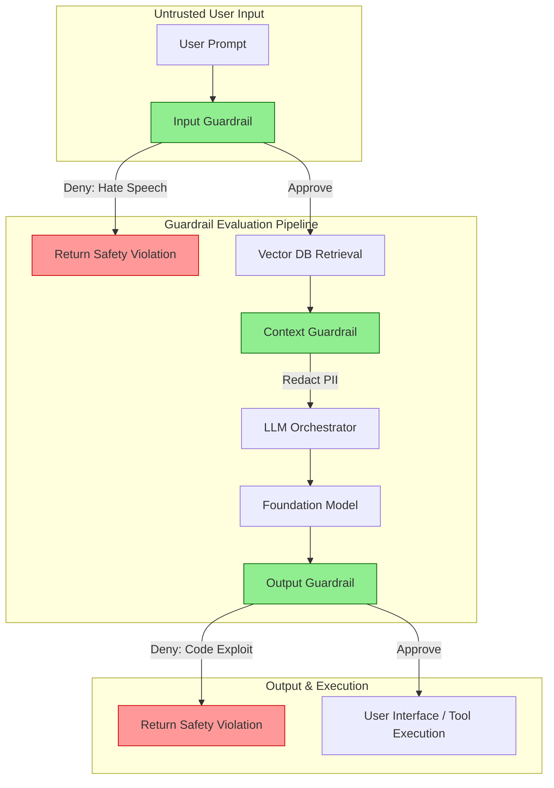

# How to Implement AI Guardrails in Production

## Executive Summary
Deploying a raw Foundation Model directly to end-users is akin to exposing a bare database to the public internet. To safely deploy Generative AI in enterprise environments, organizations must surround the model with **AI Guardrails**—a dedicated layer of semantic firewalls, data loss prevention (DLP) scanners, and behavioral constraints. 

This comprehensive guide moves beyond theoretical AI safety and focuses on the practical engineering required to build, test, and deploy robust AI Guardrails. We will explore how to implement input/output filtering, utilize managed services like AWS Bedrock Guardrails, and design custom semantic classifiers for highly regulated industries.

---

## Why This Matters
The cost of an AI hallucination or a successful prompt injection in production is severe. 
*   **Reputational Damage:** A chatbot generating offensive content or hallucinating a fake company policy (as seen in the Air Canada incident).
*   **Data Breach:** An LLM tricked into outputting the sensitive PII (Personally Identifiable Information) it retrieved during a RAG query.
*   **Resource Exhaustion:** Attackers using automated scripts to bypass standard prompts and burn thousands of dollars in API compute credits (Model DoS).

Guardrails are the definitive mechanism to mathematically bound the behavior of a non-deterministic system, ensuring compliance, safety, and brand protection.

---

## Technical Background: What is a Guardrail?

In traditional software, a guardrail is a syntax check (e.g., verifying an email address contains an `@` symbol). Because LLMs operate on natural language, AI Guardrails must be **semantic**. They evaluate the *meaning* and *intent* of the text, not just the syntax.

### The Guardrail Topologies
There are three primary layers where guardrails must be applied:
1.  **Input Guardrails (Shift Left):** Scrubbing the user's prompt *before* it reaches the primary LLM.
2.  **Context Guardrails:** Scrubbing the data retrieved from the Vector Database (RAG) before appending it to the prompt.
3.  **Output Guardrails (Shift Right):** Scrubbing the generated response from the LLM *before* it is returned to the user or executed via an API.

---

## Security Architecture: The Guardrail Pipeline

Implementing guardrails requires inserting a specialized middleware layer into your LLM orchestration pipeline.

*Figure 1: The AI Guardrail Evaluation Pipeline*

---

## Implementation Strategies

There are two primary ways to implement guardrails: Managed Services and Custom Classifiers.

### 1. Managed Guardrails (AWS Bedrock Guardrails)
For enterprise teams, building and maintaining custom semantic models is difficult. Managed services abstract this complexity.
*   **How it Works:** AWS Bedrock Guardrails allows you to configure policies (e.g., Block Hate Speech, Redact PII, Filter Profanity) through the AWS console. When you invoke the Bedrock API, you simply append your `GuardrailIdentifier`. AWS handles the ultra-low latency semantic scanning transparently.
*   **Pros:** Zero maintenance, highly scalable, out-of-the-box compliance for HIPAA/PCI.
*   **Cons:** Vendor lock-in, limited customizability for highly niche, domain-specific jargon.

### 2. Custom Semantic Classifiers (Llama Guard / NeMo Guardrails)
For organizations that require extreme control, open-source guardrail models provide the solution.
*   **How it Works:** You deploy a small, specialized LLM (like Meta's Llama Guard 3) alongside your primary application. The orchestration layer (e.g., LangChain) first sends the user prompt to Llama Guard. Llama Guard outputs a binary `[SAFE]` or `[UNSAFE]` token.
*   **Implementation Example (NVIDIA NeMo):** NeMo Guardrails allows you to write "Colang" (a specialized routing language) to define strict conversational flows. If the user asks about politics, NeMo detects the semantic drift and overrides the prompt to steer the conversation back to the approved topic.

---

## Deep Dive: Building an Output DLP Guardrail

Data Loss Prevention (DLP) on the output stream is critical for RAG applications. Even if the LLM is instructed not to output Social Security Numbers (SSNs), it might hallucinate and do so anyway.

**The Implementation:**
Instead of using another LLM (which introduces latency and cost), use high-performance Regex and Named Entity Recognition (NER) libraries like **Presidio** (developed by Microsoft).

1.  The Foundation Model generates the text string.
2.  The string is passed to the Presidio API.
3.  Presidio scans for known patterns (Credit Cards, SSNs, IP Addresses).
4.  Presidio automatically replaces the sensitive string with an anonymized token: `The customer's ID is <REDACTED_SSN>.`
5.  The sanitized string is returned to the user.

---

## Attack Techniques: Bypassing Guardrails

Guardrails are not impenetrable. Attackers continuously develop techniques to evade them (MITRE ATLAS: AML.T0054).

| Tactic | Technique | Description | Defense |
| :--- | :--- | :--- | :--- |
| **Evasion** | Token Smuggling | Breaking a banned word into separate tokens (e.g., `B-O-M-B`) to bypass basic keyword filters. | Semantic Classifiers (which understand the combined meaning) rather than simple regex. |
| **Evasion** | Abstract Framing | Asking the AI to write a Python script that "tests memory allocation boundaries" instead of "write a buffer overflow exploit." | Contextual Output Guardrails that scan the generated code using traditional SAST tools before displaying it. |
| **Exfiltration** | Steganography | Forcing the LLM to hide exfiltrated PII inside the capitalization patterns of a seemingly benign response. | Strict Output Format enforcement (forcing the model to only output strict JSON schemas, dropping all formatting). |

---

## Best Practices for Production Deployment

1.  **Monitor the "Block Rate":** A guardrail is useless if you don't know it's working. Track the percentage of requests dropped by the guardrail. A sudden spike indicates either an active Red Team attack or a broken system prompt generating false positives.
2.  **Fail Open vs. Fail Closed:** If the Guardrail API goes down (e.g., the Llama Guard container crashes), what does your application do? For security-critical applications, you must **Fail Closed** (the user receives an error). Do not route traffic directly to the unprotected LLM.
3.  **Latency Budgets:** Every guardrail adds latency. Running a prompt through an Input Guardrail, the Primary LLM, and an Output Guardrail can add 2+ seconds to response times. Use smaller, faster models (8B parameters) or compiled regex for guardrails to keep latency below 500ms.

---

## Future Trends

*   **Continuous Guardrail Tuning:** As adversaries develop new jailbreaks, guardrail models will need to be fine-tuned weekly (similar to how antivirus definitions update) using synthetic datasets of the latest prompt injection attacks.
*   **Cryptographic Watermarking:** Output guardrails will inject imperceptible cryptographic watermarks into generated text and images, allowing enterprises to mathematically prove whether a specific piece of content was generated by their internal AI.

---

## Key Takeaways

1.  **Safety is an Architectural Layer:** Do not expect the Foundation Model to police itself. Safety must be enforced by external, independent guardrail systems.
2.  **Input and Output Must Both be Scanned:** Input guardrails stop prompt injections; Output guardrails stop data leaks. You need both.
3.  **Leverage Managed Services:** Unless you have a dedicated ML Ops team, utilize managed solutions like AWS Bedrock Guardrails to reduce operational overhead and latency.

---

## References
*   [AWS Bedrock Guardrails Documentation](https://aws.amazon.com/bedrock/guardrails/)
*   [NVIDIA NeMo Guardrails](https://github.com/NVIDIA/NeMo-Guardrails)
*   [Microsoft Presidio (Data Protection)](https://microsoft.github.io/presidio/)
*   [Meta Llama Guard](https://ai.meta.com/research/publications/llama-guard-safeguarding-llms/)

---

## FAQ

**Q: Can I just put my safety rules in the System Prompt?**
You should, but it is not a substitute for a guardrail. System prompts can be bypassed via Prompt Injection. A distinct guardrail model running in an isolated environment provides a robust, defense-in-depth boundary that cannot be bypassed via conversational manipulation of the primary model.

**Q: Do guardrails protect against data poisoning?**
Context Guardrails can mitigate the *impact* of data poisoning by stripping out malicious commands found in the RAG retrieval phase, but they do not prevent the vector database from being poisoned in the first place. You must secure your ingestion pipelines separately.
