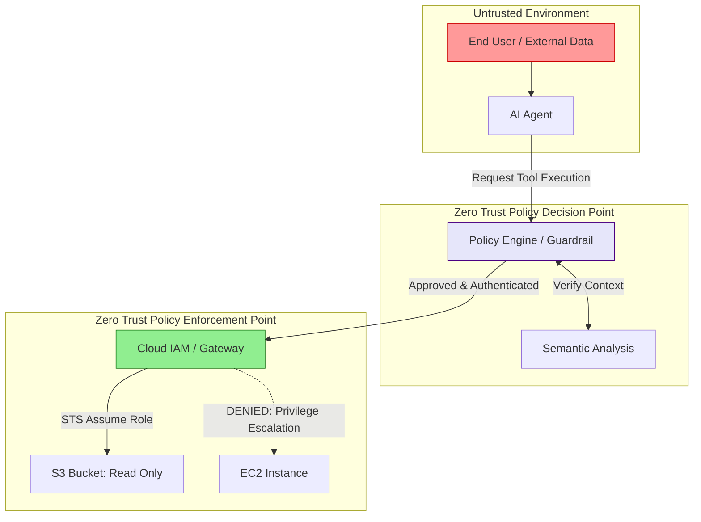

# Zero Trust Architecture for Autonomous AI Agents

## Executive Summary
The fundamental tenet of Zero Trust is "Never Trust, Always Verify." For a decade, this principle has governed how organizations secure human users and traditional software services. But how do you enforce Zero Trust when the "user" is a non-deterministic, autonomous Artificial Intelligence Agent capable of writing code and orchestrating cloud infrastructure?

This guide adapts the Zero Trust paradigm for Agentic AI. We will explore how to assign cryptographic identities to LLM agents, implement extremely granular IAM (Identity and Access Management) boundaries, and ensure that a Prompt Injection attack cannot result in a systemic enterprise breach.

---

## Why This Matters
As organizations transition to Agentic AI, they are granting LLMs the ability to execute API calls (Tool Use). An AI agent designed to triage ServiceNow tickets might be given an API key that has `admin` rights across the entire ServiceNow instance because "it's easier."

If an attacker successfully compromises that agent via Indirect Prompt Injection, the agent becomes a **Confused Deputy**. The attacker inherits the agent's `admin` API key and can exfiltrate tickets, modify infrastructure, or execute lateral movement. Applying Zero Trust to AI Agents is the only way to mathematically constrain the blast radius of a successful LLM exploit.

---

## Technical Background: The Confused Deputy Problem

The "Confused Deputy" is an archaic software security problem that has returned with a vengeance in the AI era. It occurs when a computer program (the deputy) that has a higher level of privilege is tricked by another program (the attacker) into misusing those privileges.

Because LLMs process instructions and data within the same context window, they are inherently susceptible to becoming confused deputies. If an LLM is given an AWS IAM Role with `AmazonS3FullAccess` just so it can read one file, an attacker can use prompt injection to force the LLM to delete every bucket in the account. The cloud provider doesn't block the deletion because, cryptographically, the request came from a trusted, authenticated IAM role (the LLM).

---

## Security Architecture: Zero Trust AI Deployment

To secure an AI Agent, we must build a Zero Trust perimeter around its Tool Execution layer.

*Figure 1: Zero Trust Architecture for Agentic Tool Use*

---

## The Core Pillars of Zero Trust for AI

### 1. Identity (The SPIFFE Standard)
You cannot authorize what you cannot identify. Traditional API keys are static and prone to leakage. AI Agents in a microservice or multi-agent architecture should be assigned cryptographic identities.
*   **Implementation:** Use standards like **SPIFFE (Secure Production Identity Framework for Everyone)**. Before an AI Agent can call a backend database via the Model Context Protocol (MCP), it must present a short-lived SPIFFE ID (an X.509 certificate) verifying *which* specific agent it is (e.g., the `Threat_Hunting_Agent` vs. the `HR_Summarization_Agent`).

### 2. The Principle of Least Privilege (PoLP)
Never grant an agent standing `Write` access to a database if it only needs to `Read`.
*   **Implementation:** If deploying an agent in AWS, do not use long-lived Access Keys. The Agent's backend orchestrator (e.g., an ECS container) should assume a specific AWS IAM Role using AWS STS (Security Token Service). The IAM policy attached to this role must be obsessively scoped down to the exact resources and exact actions the agent requires.

### 3. Micro-segmentation of Tools
If an agent needs to perform two highly disparate tasks, split it into two agents.
*   **Example:** Do not create a single "Cloud Admin Agent" that can read S3 buckets *and* modify Security Groups. Create an `S3_Reader_Agent` and a `Security_Group_Agent`. This micro-segmentation ensures that if an attacker compromises the context window of the S3 Agent via a poisoned file, the attacker cannot leverage that foothold to modify firewall rules.

---

## Attack Scenarios & Mitigations

### Scenario: The Privileged RAG Hijack
**The Attack:** An enterprise RAG system has access to the entire corporate Confluence wiki using a generic "Service Account." An intern creates a page containing a prompt injection payload. When the CEO asks the AI a question that pulls the intern's page into context, the payload executes. Because the AI is using a generic service account, the payload commands the AI to read highly confidential board documents and summarize them to the intern's email.
**The Mitigation (Just-in-Time Access):** The AI should *never* have its own standing access to the entire wiki. Under Zero Trust, the AI must use **OBO (On-Behalf-Of) Authentication**. When the CEO asks the question, the AI assumes the identity of the CEO (using OAuth token exchange). The AI can now only read the documents the CEO is allowed to read. If the intern tries the attack, the AI assumes the intern's identity and is denied access to the board documents by the wiki's RBAC.

---

## Defensive Controls: The Human-in-the-Loop (HITL) Circuit Breaker

The ultimate Zero Trust control for Agentic AI is refusing to trust it with destructive actions.

For any tool execution that involves modifying state (e.g., `UpdateDatabase`, `SendEmail`, `TerminateInstance`), the orchestration layer must pause execution.
*   **The HITL Gateway:** The AI orchestrator sends a webhook to Slack or Microsoft Teams.
*   **The Message:** "Agent `DevOps_Bot` has requested to execute `terraform destroy` on `prod-cluster-1`. Reason: User requested cleanup. Proceed?"
*   **The Resolution:** A human administrator must cryptographically sign the approval (e.g., via Okta Verify or a YubiKey tap) before the backend API Gateway accepts the LLM's request.

---

## Detection Methods & DFIR

In a Zero Trust environment, logs are the lifeblood of incident response.

1.  **IAM Anomaly Detection:** Use tools like AWS CloudTrail or Wazuh XDR to monitor the API calls made by the AI Agent's specific IAM role. If the `HR_Agent` role suddenly makes a `ListBuckets` API call, your SIEM must trigger an immediate High-Severity alert.
2.  **Context Window Forensics:** If an agent executes an unauthorized action, you must be able to prove *why*. Your logging architecture must immutably store the exact prompt string (System Prompt + RAG Context + User Input) that the orchestrator sent to the Foundation Model exactly 1 second prior to the unauthorized API call.

---

## Best Practices

1.  **Assume Breach:** Always assume the LLM has already succumbed to a Prompt Injection. Design the backend API it connects to such that a compromised LLM can do no meaningful damage.
2.  **Ephemeral Environments:** If an agent needs to execute Python code (e.g., for data analysis), execute that code inside an ephemeral, network-isolated Docker container (or a WebAssembly sandbox) that is destroyed immediately after execution.
3.  **Audit the Prompts like Code:** Treat System Prompts as security-critical infrastructure. Any change to a System Prompt should require a Pull Request, a code review, and automated regression testing.

---

## Future Trends

*   **Cryptographic Prompt Verification:** Future Zero Trust implementations will likely require every piece of context fed into an LLM (from a database or user) to be cryptographically signed. If an LLM receives an instruction that lacks a valid digital signature from an authorized system, the model will refuse to process it.
*   **AI-Specific Identity Providers:** We will see the emergence of Identity Providers (IdPs) specifically designed to manage the lifecycle, permissions, and behavior analytics of autonomous Agentic workloads, rather than hacking human-focused solutions (like Active Directory) to fit machines.

---

## Key Takeaways

1.  **Agents are Confused Deputies:** Without strict Zero Trust boundaries, an LLM is a loaded weapon waiting for an attacker to point it.
2.  **Use On-Behalf-Of Auth:** Whenever possible, the AI should assume the IAM identity of the human user interacting with it, inheriting their exact permission scope.
3.  **Enforce HITL for State Changes:** Never allow an autonomous agent to execute destructive actions without multi-factor human approval.

---

## References
*   [NIST SP 800-207: Zero Trust Architecture](https://csrc.nist.gov/publications/detail/sp/800-207/final)
*   [OWASP LLM Vulnerability: Excessive Agency](https://owasp.org/www-project-top-10-for-large-language-model-applications/)
*   [SPIFFE: Secure Production Identity Framework for Everyone](https://spiffe.io/)

---

## FAQ

**Q: Does Zero Trust mean the AI cannot be fully autonomous?**
Yes and no. The AI can be fully autonomous for *read-only* tasks (research, log analysis, summarization). For *write* operations (executing code, sending emails), Zero Trust dictates that a human circuit breaker must exist unless the blast radius of a mistake is mathematically proven to be zero.

**Q: How do I manage API keys for my agents?**
Do not use static API keys if you can avoid it. Use dynamic, short-lived credentials via IAM Roles, STS, or OIDC (OpenID Connect). If an agent's container is compromised, the credential should expire within minutes.
